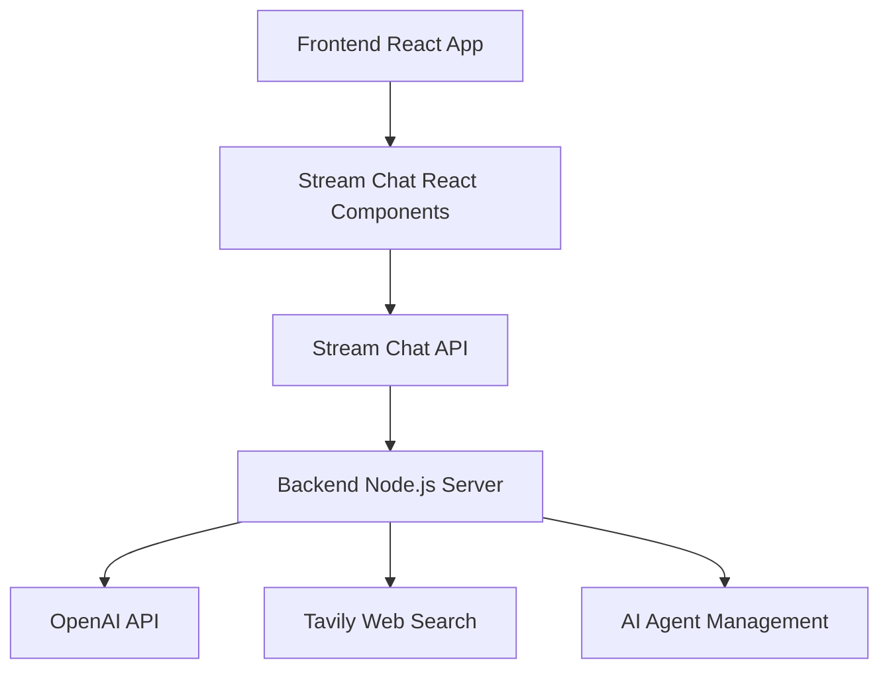

# Chat AI App

A modern AI-powered chat application built with **Stream Chat**, **OpenAI**, and **web search capabilities**. This full-stack application provides an intelligent writing assistant that can help with content creation, research, and real-time collaboration.

## 🚀 Features

- **Real-time Chat**: Powered by [GetStream.io](https://getstream.io) for seamless messaging
- **AI Writing Assistant**: Google Gemini 2.5 Flash integration for intelligent content generation
- **Web Search**: Live web search capabilities using Tavily API for current information (automatically triggered when needed) ✅
- **Image Generation**: AI-powered image creation using Google's Gemini 2.5 Flash Image model via OpenRouter ✅
- **Image Editing**: AI-powered image editing (placeholder for future implementation)
- **Image Analysis**: AI-powered image analysis using Google's Gemini 2.5 Flash Image model via OpenRouter ✅
- **Modern UI**: Beautiful React interface with dark/light theme support
- **Writing Prompts**: Categorized writing prompts for business, content, communication, and creative tasks
- **Agent Management**: Dynamic AI agent lifecycle management
- **Secure Authentication**: JWT-based token authentication
- **Responsive Design**: Mobile-first design with Tailwind CSS

## 🏗️ Architecture

### Backend (`nodejs-ai-assistant/`)

- **Node.js/Express** server
- **Stream Chat** server-side integration
- **Google Gemini 2.5 Flash** via OpenAI-compatible API for AI responses
- **Tavily API** for intelligent web search functionality (auto-triggered)
- Agent management system with automatic cleanup

### Frontend (`react-stream-ai-assistant/`)

- **React** with TypeScript
- **Stream Chat React** components
- **Tailwind CSS** + **shadcn/ui** for modern styling
- **Vite** for fast development and building

## 📋 Prerequisites

- Node.js 20 or higher
- npm or yarn package manager
- GetStream.io account (free tier available)
- Google Gemini API key (free tier available)
- Tavily API account (for web search - free tier available)
- OpenRouter API key (for image generation/analysis)

## 🛠️ Setup Instructions

### 1. Clone the Repository

```bash
git clone <your-repository-url>
cd chat-ai-app
```

### 2. Backend Setup

Navigate to the backend directory:

```bash
cd nodejs-ai-assistant
```

Install dependencies:

```bash
npm install
```

Create environment file by copying the example:

```bash
cp .env.example .env
```

Configure your `.env` file with the following keys:

```env
# GetStream credentials - Get these from https://getstream.io/dashboard
STREAM_API_KEY=your_stream_api_key_here
STREAM_API_SECRET=your_stream_api_secret_here

# Google Gemini API key - Get from https://aistudio.google.com/app/apikey
GEMINI_API_KEY=your_gemini_api_key_here

# Tavily API key - Get from https://tavily.com (for web search functionality)
TAVILY_API_KEY=your_tavily_api_key_here

# OpenRouter API key - Get from https://openrouter.ai (for image generation/analysis)
OPENROUTER_API_KEY=your_openrouter_api_key_here

# Web origin for CORS (adjust for your domain)
WEB_ORIGIN=http://localhost:5173
```

### 3. Frontend Setup

Navigate to the frontend directory:

```bash
cd ../react-stream-ai-assistant
```

Install dependencies:

```bash
npm install
```

Create environment file:

```bash
cp .env.example .env
```

Configure your `.env` file:

```env
# Stream Chat Configuration
VITE_STREAM_API_KEY=your_stream_api_key_here

# Backend URL
VITE_BACKEND_URL=http://localhost:3000
```

### 4. Getting API Keys

#### GetStream.io Setup

1. Sign up at [GetStream.io](https://getstream.io/chat/trial/)
2. Create a new Chat application
3. Copy your **API Key** and **API Secret** from the dashboard
4. Use the same **API Key** in both backend and frontend `.env` files

#### Google Gemini API Setup

1. Visit [Google AI Studio](https://aistudio.google.com/app/apikey)
2. Sign in with your Google account
3. Click "Get API key" or "Create API key"
4. Copy your API key and add it to your backend `.env` file as `GEMINI_API_KEY`
5. Free tier includes generous quotas for development

#### Tavily API Setup

1. Sign up at [Tavily](https://tavily.com/)
2. Get your API key from the dashboard
3. Add it to your backend `.env` file

#### OpenRouter API Setup

1. Sign up at [OpenRouter](https://openrouter.ai/)
2. Get your API key from the dashboard
3. Add it to your backend `.env` file
4. This enables image generation and analysis using Google's Gemini 2.5 Flash Image model

## 🚀 Running the Application

### Start the Backend Server

```bash
cd nodejs-ai-assistant
npm run dev
```

The backend will run on `http://localhost:3000`

### Start the Frontend Application

```bash
cd react-stream-ai-assistant
npm run dev
```

The frontend will run on `http://localhost:8080`

## 📖 How GetStream.io Works

[GetStream.io](https://getstream.io) is a cloud-based API service that provides real-time chat functionality. Here's how it integrates with our app:

### Core Concepts

1. **Stream Chat Client**: Handles all chat operations and real-time updates
2. **Channels**: Individual chat rooms where messages are exchanged
3. **Users**: Authenticated participants in the chat
4. **Messages**: Text, files, reactions, and custom data
5. **Tokens**: JWT-based authentication for secure access

### Integration Flow



### Key Features Used

- **Real-time Messaging**: Instant message delivery and updates
- **User Presence**: Online/offline status indicators
- **Channel Management**: Create, join, and manage chat channels
- **Message Threading**: Support for threaded conversations
- **File Uploads**: Share images and documents
- **Custom Fields**: Extended message and user data
- **Webhooks**: Server-side event handling

## 🤖 AI Agent System

The application features a sophisticated AI agent management system:

### Agent Lifecycle

1. **Creation**: AI agents are created per channel when requested
2. **Initialization**: Google Gemini model setup with web search tool calling
3. **Message Handling**: Processes user messages and generates responses
4. **Web Search**: Automatically triggered when current information is needed
5. **Cleanup**: Automatic disposal after inactivity

### 🔍 How Web Search Works

The AI agent automatically detects when it needs current, real-time information and triggers a web search:

1. **Smart Detection**: The AI identifies queries requiring up-to-date information
2. **Tool Call**: Gemini makes a function call to the `web_search` tool
3. **Tavily Search**: Performs a search using Tavily API with the generated query
4. **Context Integration**: Search results are added to the conversation
5. **Final Response**: AI generates a comprehensive answer based on the search results

**Example queries that trigger web search:**
- "What's the latest news about AI?"
- "Current weather in New York"
- "Recent developments in quantum computing"
- "Today's stock market performance"

The web search happens seamlessly in the background, and users see a status indicator showing "Using external sources" during the search.

### Agent Capabilities

- **Content Writing**: Various writing tasks from business to creative
- **Web Research**: Automatically searches the web when current information is needed ✅
- **Context Awareness**: Maintains conversation context with history management
- **Customizable Prompts**: Specialized writing assistance
- **Tool Calling**: Intelligent detection of when to use external tools like web search

## 🎨 UI Components

The frontend uses modern UI components built with:

- **Radix UI**: Accessible component primitives
- **Tailwind CSS**: Utility-first CSS framework
- **shadcn/ui**: Beautiful, customizable components
- **Lucide React**: Modern icon library
- **Dark Mode Support**: System preference detection

## 📡 API Endpoints

### Backend Routes

- `GET /` - Health check and server status
- `POST /start-ai-agent` - Initialize AI agent for a channel
- `POST /stop-ai-agent` - Stop and cleanup AI agent
- `GET /agent-status` - Check AI agent status
- `POST /token` - Generate user authentication tokens
- `POST /images/generate` - Generate images from text prompts using Gemini 2.5 Flash Image ✅
- `POST /images/edit` - Edit existing images (placeholder endpoint)
- `POST /images/analyze` - Analyze images using Gemini 2.5 Flash Image ✅

## 🔒 Security Features

- **JWT Authentication**: Secure token-based authentication
- **Environment Variables**: Sensitive data protection
- **CORS Configuration**: Cross-origin request security
- **Token Expiration**: Automatic token refresh system
- **Input Validation**: Server-side validation for all requests

## 🚀 Deployment

### Backend Deployment

1. Set environment variables on your hosting platform
2. Run `npm run start` for production
3. Ensure PORT is configured (defaults to 3000)

### Frontend Deployment

1. Run `npm run build` to create production build
2. Deploy the `dist` folder to your static hosting service
3. Configure environment variables for production

## 🛠️ Development

### Backend Development

```bash
cd nodejs-ai-assistant
npm run dev  # Starts with nodemon for auto-reload
```

### Frontend Development

```bash
cd react-stream-ai-assistant
npm run dev  # Starts Vite dev server
```

### Building for Production

```bash
# Backend
cd nodejs-ai-assistant
npm run start

# Frontend
cd react-stream-ai-assistant
npm run build
```

## 📚 Technologies Used

### Backend

- **Node.js** - Runtime environment
- **Express** - Web framework
- **Stream Chat** - Real-time messaging
- **Google Gemini 2.5 Flash** - AI language model
- **Tavily API** - Web search capabilities
- **Axios** - HTTP client
- **CORS** - Cross-origin resource sharing
- **TypeScript** - Type safety

### Frontend

- **React** - UI library
- **TypeScript** - Type safety
- **Vite** - Build tool
- **Stream Chat React** - Chat UI components
- **Tailwind CSS** - Styling
- **Radix UI** - Accessible components
- **React Hook Form** - Form handling
- **React Router** - Navigation

## 🤝 Contributing

1. Fork the repository
2. Create a feature branch
3. Make your changes
4. Test thoroughly
5. Submit a pull request

## 📄 License

This project is licensed under the MIT License.

## 🆘 Support

For support and questions:

- Check the [GetStream.io Documentation](https://getstream.io/chat/docs/)
- Review [OpenAI API Documentation](https://platform.openai.com/docs)
- Create an issue in this repository

---

Built with ❤️ using GetStream.io, OpenAI, and modern web technologies.
